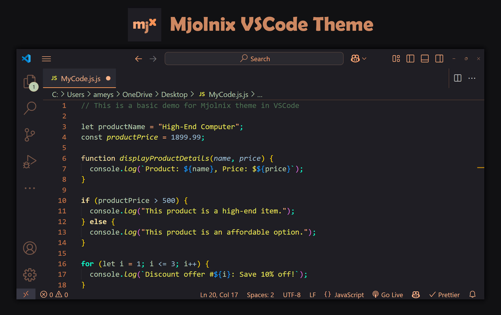

# Mjolnix Theme for VS Code

Mjolnix is a dark theme with light orange, red, and yellow accents for Visual Studio Code. The theme provides a comfortable viewing experience with carefully chosen colors for better code readability.

## Installation

Installing Mjolnix is the same as installing any other VS Code theme. You can simply download it from the Extensions panel.

1. Open **Extensions** sidebar in VS Code (`Ctrl+Shift+X` or `Cmd+Shift+X`)
2. Search for `Mjolnix`
3. Click **Install**
4. Open the Command Palette (`Ctrl+Shift+P` or `Cmd+Shift+P`)
5. Select **Preferences: Color Theme** and choose **Mjolnix**

## Features

- Dark grey background that's easy on the eyes
- Carefully selected accent colors:
  - Light orange highlights
  - Red accents
  - Yellow emphasis
- Consistent syntax highlighting
- Clear contrast for better readability
- Thoughtfully designed UI elements

## Issues

Found a bug or have a suggestion? Please open an issue on the [GitHub repository](https://github.com/ameysh/mjolnix/issues).

## Contributing

Interested in contributing? Please see [CONTRIBUTING](CONTRIBUTING.md)

## License

This theme is released under the [MIT License](LICENSE).

## Author

Created by Amey Rajesh Shaligram

---

**Enjoy!**
